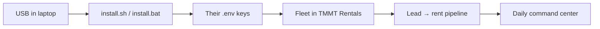

# Team Onboarding Playbook — Car Rental Business in a Box

**Audience:** Your onboarding team (not investors).  
**Goal:** Plug USB → install on Mac or Windows → connect systems → get vehicles and customers live for rentals and add-on services.

**Operator-only tools** (wipe scripts, ops stacks) stay on your Desktop `INVESTOR_FLASH_MASTER` — never on the handoff USB. See `OPS_VS_INVESTOR.md`.

---

## The big picture (30 seconds)



| Layer | What it does |
|-------|----------------|
| **USB install** | Copies SOPs, prompts, and app source to their machine |
| **TMMT Rentals** | Fleet, leads, contracts, payments, 8 public forms |
| **TMMT OS** | Owner portals, cases, vendors, ledger (subscription / BIAB) |
| **GHL** | CRM pipeline, texts, reminders (optional but recommended) |
| **AIXMOS** | Agents + brain — separate SKU; not required for day-one rentals |

---

## Who does what

| Role | Responsibility |
|------|----------------|
| **You (operator)** | Refresh USB from master, grant Supabase/GHL access, approve BIAB |
| **Onboarding lead** | Runs install, checks checklist, trains client admin |
| **Client owner** | Owns `.env`, fleet data, collections, hires their staff |
| **Client staff** | Uses Rentals admin + forms after training |

---

## Phase 0 — Before you visit (operator, 15 min)

1. Refresh USB from master (when drives are plugged in):
   ```bash
   cd ~/Desktop/INVESTOR_FLASH_MASTER
   ./refresh-investor-drives.sh /Volumes/AIXMOS02 /Volumes/CYBORG
   ```
2. Confirm USB root has: `START_HERE.md`, `INSTALL.md`, `TEAM_ONBOARDING_PLAYBOOK.md`, `AIX_AI_COMMAND_SYSTEM/`, `TMMT MANAGEMENT/` — **no** `AIXMOSXTMMT-OPS`, `taha1`, or `.env` with real keys.
3. Pre-create for the client (in your Supabase/GHL):
   - Supabase project or invite to your org
   - GHL sub-account / location (if using CRM)
   - Admin login email for TMMT Rentals
4. Pack: USB, printed one-pager (`INVESTOR_ONE_PAGER.md`), this playbook on your phone.

---

## Phase 1 — Plug in and install (client machine, 15–20 min)

### Mac

1. Insert USB. Open **Terminal**.
2. Run from USB root (replace `YOUR_DRIVE`):
   ```bash
   cd "/Volumes/YOUR_DRIVE"
   bash install.sh
   ```
3. When prompted, edit `.env` in `AIX_AI_COMMAND_SYSTEM` with **their** keys (see Phase 2).
4. Open `START_HERE.md` on the USB.

### Windows

1. Insert USB. Note drive letter (e.g. `E:`). Open **PowerShell**.
2. Run:
   ```powershell
   cd E:\
   .\install.bat
   ```
3. Edit `E:\AIX_AI_COMMAND_SYSTEM\.env` with their keys.
4. Open `START_HERE.md`.

### Optional — run TMMT Rentals locally (training demo)

**Mac:**
```bash
cd "/Volumes/YOUR_DRIVE/TMMT MANAGEMENT"
cp .env.example .env.local   # if present; else use project docs
npm install
npm run dev
```
Open `http://localhost:3000` → venture home → **TMMT Rentals**.

**Windows:** Same paths with `E:\TMMT MANAGEMENT\`.

Production URL (when deployed): use your Vercel link; training can be local first.

---

## Phase 2 — Connect their systems (30–45 min)

| System | Required? | What to configure |
|--------|-----------|-------------------|
| **Supabase** | Yes | URL + anon key + service role (admin only) in `.env` / `.env.local` |
| **Airtable** | Legacy / optional | Token + base ID if still syncing |
| **GoHighLevel** | Recommended | Location, pipeline per `TMMT MANAGEMENT/INTEGRATIONS/GHL_RENTAL_PIPELINE_BLUEPRINT.md` |
| **Stripe** | Soon | For $97/mo Rentals — not wired in code yet; use manual payment tracking until live |

**Team checklist:**

- [ ] Admin can log in to Rentals (`/v/tmmt-rentals` or production URL)
- [ ] GHL custom fields: `vehicle_assigned`, payment stage (see integration docs on USB)
- [ ] `.env` saved only on their machine — never copy back to USB

---

## Phase 3 — Vehicle onboarding (per car, 20–30 min)

**Order matters:** vehicle ready in system → then assign to customers.

### Step A — Add vehicle to fleet

1. Admin → **Fleet** (`/v/tmmt-rentals/fleet`).
2. Create record: VIN/plate, make/model, year, status **Available**.
3. Attach: insurance expiry, registration, toll tag, maintenance schedule.

### Step B — Onboarding inspection (23-field form)

1. Send or complete: **`/forms/onboarding-inspection`** (full onboarding inspection).
2. Photos + condition → stored in `customer_inspection_photos` / inspection tables.
3. Set status **Available** only after pass.

### Step C — Ongoing vehicle lifecycle

| Status | Meaning | Next action |
|--------|---------|-------------|
| Available | Ready to rent | Assign on handover |
| Rented out | With customer | Track in Customers + payments |
| Maintenance | Shop / repair | Block from new assignments |
| Retired | Sold or totaled | Archive |

Reference: `TMMT MANAGEMENT/docs/PIPELINE-FLOW.md` (vehicle lifecycle diagram).

### Step D — Other services (same car)

| Service | Where |
|---------|--------|
| Extra rental types / swap | Contracts + custom contract types |
| Insurance claim | `/insurance` |
| Partner / investor view | Partner portal (read-only fleet) |
| Vendor work (detailing, shop) | TMMT OS cases + vendor jobs (BIAB / OS tier) |
| Marketplace listing | TMMT OS `/marketplace` (when enabled) |

---

## Phase 4 — Customer & rental pipeline (train the client team)

Walk through once live, then leave them the form links:

| Step | Admin page | Public form |
|------|------------|-------------|
| 1. Lead | `/leads` | `/forms/lead-intake` |
| 2. Background check | `/background-checks` | (internal) |
| 3. Waitlist | `/waitlist` | — |
| 4. Appointment | `/appointments` | `/forms/appointment` |
| 5. Handover | — | `/forms/handover` |
| 6. Active customer | `/customers` | — |
| 7. Return / former | `/former-customers` | — |

**Training script (45 min):**

1. **10 min** — Lead intake form → qualify in Leads.
2. **10 min** — Background check pass/fail → waitlist vs appointment.
3. **15 min** — Handover form → active customer → payment schedule.
4. **10 min** — Daily ops: `OPERATIONS/COMMAND_CENTER.md` rhythm (money, fleet, bookings).

GHL mirrors stages: `INTEGRATIONS/GHL_RENTAL_PIPELINE_BLUEPRINT.md`.

---

## Phase 5 — Business model packages (what they bought)

| Package | They get | Your team does |
|---------|----------|----------------|
| **$97/mo Rentals** | TMMT Rentals admin + forms | Phases 1–4 only |
| **BIAB / $15K mentorship** | Rentals + onboarding + coaching | Phases 1–4 + weekly check-ins + GHL setup |
| **TMMT OS subscription** | Portals, ledger, cases, investor view | Deploy `tmmt-os`, map entitlements |
| **AIXMOS Command Center** | Agents + brain (separate) | Do not install ops stack from USB; sell separately |

---

## Phase 6 — First week success criteria

| Day | Milestone |
|-----|-----------|
| 1 | Install done, admin login works, 1 test vehicle in fleet |
| 2 | Onboarding inspection completed for first real unit |
| 3 | GHL pipeline stages match Rentals statuses |
| 4 | Lead intake tested end-to-end (test lead → delete) |
| 5 | First real lead or customer in pipeline |
| 7 | Owner runs daily command center (money / fleet / bookings) |

---

## Troubleshooting (team)

| Issue | Fix |
|-------|-----|
| `install.sh` permission denied (Mac) | `chmod +x install.sh` then rerun |
| Windows blocks PowerShell | `Set-ExecutionPolicy -Scope Process Bypass` |
| No `AIX_AI_COMMAND_SYSTEM` on USB | Drive not refreshed — operator reruns `refresh-investor-drives.sh` |
| Can't log in to Rentals | Check Supabase URL/keys and user in Auth |
| Vehicle stuck "not available" | Complete onboarding inspection; check maintenance flag |

---

## Doc map on the USB (read order)

1. `START_HERE.md` — Mac vs Windows
2. `INSTALL.md` — full install
3. **`TEAM_ONBOARDING_PLAYBOOK.md`** — this file
4. `AIX_AI_COMMAND_SYSTEM/START_HERE.md`
5. `TMMT MANAGEMENT/docs/PIPELINE-FLOW.md` — customer + vehicle flows
6. `TMMT MANAGEMENT/OPERATIONS/COMMAND_CENTER.md` — daily owner rhythm
7. `TMMT MANAGEMENT/INTEGRATIONS/GHL_RENTAL_PIPELINE_BLUEPRINT.md` — CRM
8. `docs/investor-flash/INVESTOR_FLASH.md` — product story (optional for licensees)

---

## Operator reminder

- **Clean USB** = client/team safe handoff.  
- **Desktop `INVESTOR_FLASH_MASTER`** = factory + ops scripts + your secrets workflow.  
- **Paid ops access** = you grant Supabase/GHL/deploy — never pre-load your keys on investor USB.
