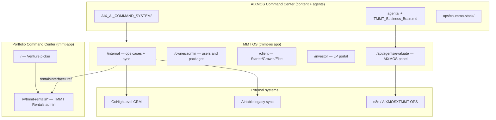

# Command Center — Architecture Map

## Product boundaries

## What shares infrastructure

| Layer | Shared | Notes |
|-------|--------|-------|
| Git monorepo | Yes | `AIX_Command_Center` |
| Supabase | Partial | Rentals DB migrated; tmmt-os has own migrations — confirm single vs dual project |
| Auth | No (today) | Separate Next apps; no unified SSO |
| Vercel | Partial | tmmt-os deployed; rentals may share host via rewrites |
| Stripe | No | Not implemented — priority for investor readiness |
| GHL webhooks | tmmt-os | `/api/webhooks/ghl` |

## What stays isolated (by design)

- **TMMT Rentals** — daily rental CRUD; do not break for portfolio experiments
- **TMMT OS** — workflow/cases/portals; sold as owner subscription
- **AIXMOS** — agents, prompts, CHUMMO voice, mentorship ladder — **separate SKU**
- **INVESTOR_FLASH_MASTER** — sanitized clone, no secrets

## Target state (90 days)

One **Stripe account**, four **Products**, shared **Supabase org** with schema namespaces, single **auth issuer** (Supabase or Clerk) with product entitlements in JWT claims.

## Repo map

| Path | Product |
|------|---------|
| `TMMT MANAGEMENT/` | TMMT Rentals + portfolio shell |
| `TMMT MANAGEMENT/tmmt-os/` | TMMT OS |
| `agents/`, `AIX_AI_COMMAND_SYSTEM/` | AIXMOS Command Center IP |
| `all_in_one_platform/` | BIAB scaffold (early) |
