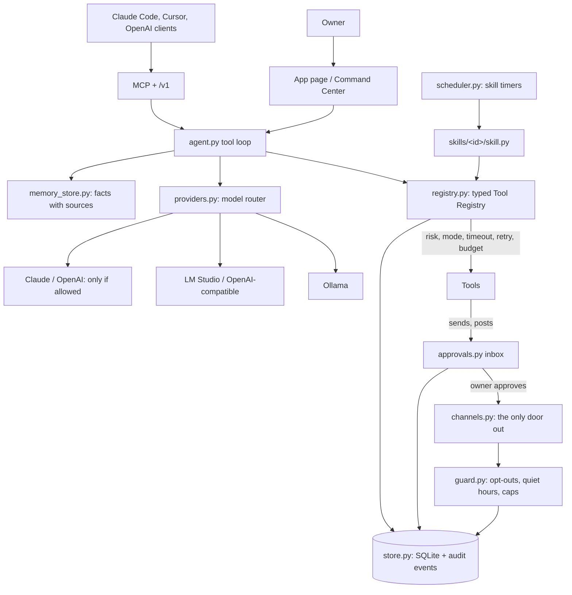

# AIXMOS architecture

How the local agent is put together today (branch `wave0/head-agent-core`). Everything named here exists in
`super-agent/` and has tests. Planned parts are listed in [AIXMOS_ROADMAP.md](AIXMOS_ROADMAP.md), not here.

## One process, one identity

AIXMOS is one Python process on the owner's computer (`project_aixmos_server.py`, 127.0.0.1:8770). The app page,
the OpenAI-compatible `/v1` surface, the MCP server (`/mcp` and the stdio `aixmos_local.py mcp`) and the
scheduler all call the **same** agent, tools, permissions, memory and audit trail. There are no separate bots.

## The boundaries

| Boundary | Module | What it guarantees |
|---|---|---|
| Model router | `providers.py` | One interface for Ollama, LM Studio / any OpenAI-compatible server, Anthropic, OpenAI, Claude Code CLI, Codex CLI. Local first; falls back on an outage (never on a bad request or a policy refusal); cloud only when the owner allowed it and it is connected; automatic cloud calls are charged to the daily budget first. `llm.py` keeps the old helper API on top of it. |
| Tool Registry | `registry.py` | Every tool has risk (LOW / MEDIUM / HIGH), read/write, an authority class, an approval mode (AUTO / SESSION / ALWAYS / BLOCKED), timeout, bounded retries for reads, paid and untrusted-output flags. See [AIXMOS_PERMISSIONS.md](AIXMOS_PERMISSIONS.md). |
| Execution | `agent.py` `call_tool` | Enforces the registry, the autonomy level and the untrusted-content gate, charges paid tools, runs with timeout/retry, writes one audit event per call. |
| Approvals | `approvals.py` | Inbox. A send runs exactly once after an explicit approve; deciding twice never sends twice; failures go back to the owner, never retried on their own. |
| Rails | `guard.py`, `channels.py` | Opt-out / do-not-contact, quiet hours for texts, daily caps, spend budget. Re-checked at the moment of sending. |
| Scheduler | `scheduler.py` | Leased, crash-safe jobs; skills put their timers here. |
| Skills | `skillkit.py`, `skills/<id>/` | Code that ships in the product (not prompts to paste): tools, timers, executors, rules, and a playbook used as context. Licence-gated with `requires_feature`. |
| Memory | `memory_store.py` | Typed items with provenance. Models can only write notes; only the owner confirms facts; LOCAL_ONLY items never go to a cloud model. See [AIXMOS_MEMORY.md](AIXMOS_MEMORY.md). |
| Verifier | `verify.py` | Output contracts: JSON shape, and grounding (a reply may not mention prices, guarantees, insurance and similar unless the business's own facts do). |
| Machine fit | `resources.py` | Before loading a local model: READY / WAIT / OTHER_JOB_CONFLICT / INSUFFICIENT_MACHINE. Never unloads other work. |
| Secrets | `secret_store.py` | DPAPI on Windows, Keychain on macOS, 0600 file elsewhere. `settings.json` only holds a marker. |
| Licence | `licence.py`, `ed25519_verify.py` | Signed licence files verified offline with the issuer's public key. The signing key is never in the repo. |
| Store + audit | `store.py` | One SQLite file (`memory/aixmos.db`, WAL, short-lived connections). |

## Model routing in one paragraph

`providers.route(task)` builds the candidate list: Ollama, then LM Studio, then (only when `cloud_allowed` and
privacy is not PRIVATE-LOCAL) Anthropic and OpenAI. A provider is a candidate only if its health check passes
(cached 8 s) and it has the capability the task needs (`tools` for agent steps). `providers.chat()` tries the
owner's chosen model first, then the candidates in order, falling back only on outages (offline, timeout, rate
limit, server error) and recording a `model.fallback` audit event. The default local model is
`qwen3:4b-instruct` (Apache-2.0): verified to call tools correctly in the agent loop.

## What the owner sees

The **Command Center** view (rail button with a badge): the inbox, safety rails, skills with their live state and
autopilot switch, scheduled work, recent decisions, models and privacy, memory, and per-tool permissions.
Owner actions there carry a per-launch token that only the app page has, so scripts and agent tools calling the
local API cannot approve their own work.
