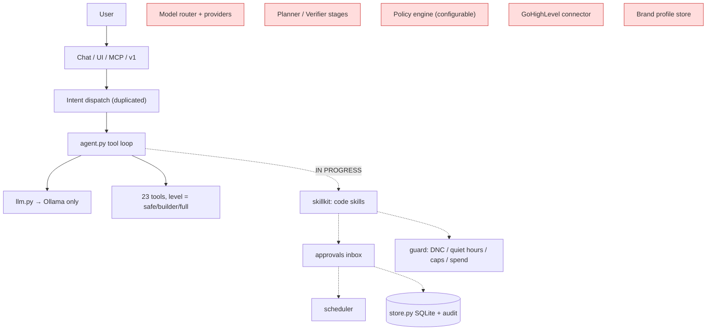

# AIXMOS — current state (audit, 2026-10-04)

What actually exists in this repo today, measured against the target "agent operating layer"
(orchestrator, planner, policy engine, model router, tool registry, connectors, verification,
memory, audit). Read-only audit of `main` + branch `wave0/head-agent-core` at `14e6517`.
Nothing here is a claim of future capability.

Status words: **WORKING** (code runs, used), **PARTIAL** (some of it), **PROMPT-ONLY** (text in a
system prompt, no code), **MISSING**, **IN PROGRESS** (being built on `wave0/head-agent-core`).

## 1. Repo shape

| Folder | Language | Role today |
|---|---|---|
| `super-agent/` | Python 3 stdlib + Pillow | **The product.** Local Agent 2.1.1: HTTP server, chat, agent loop, CRM, email, media, MCP, installer. |
| `llm-router/` | JS (Cloudflare Workers) | Cost-controlled OpenAI-compatible gateway with a credit ledger. Tested. Not wired to super-agent. |
| `gateway/` | JS (Cloudflare Workers) | Older overlapping gateway (wallet, checkout webhooks). Thin tests. |
| `agents/` | Node | Ops scripts (multi-channel SMS sender, reminders). No opt-out / do-not-contact checks. |
| `command-center/`, `brain/`, `kit/`, `starter-pack/`, `archive/` | mixed | Dashboards, notes, earlier installers. Not part of the runtime. |

A second, private line (`aixmos-client` 0.1.x, never pushed) holds pieces this repo lacks:
`engines.py` (provider router), `secret_store.py`, `memory_store.py` (provenance), `licence.py`,
a provisioner authority model and a release leak gate. They are **not** in this repo.

## 2. The 16 audit questions

| # | Question | Finding |
|---|---|---|
| 1 | Language / framework | Python stdlib `http.server` (`ThreadingHTTPServer`), no web framework. Single-page `index.html` UI. ~6.9k lines in `super-agent/`. |
| 2 | Architecture | One process. `project_aixmos_server.py` routes `/api/*`, `/v1/*`, `/mcp`. Feature modules in `super-agent/aixmos/`. Intent dispatch is duplicated in `_chat_tool` and `surfaces.run_intent` and has already drifted. |
| 3 | Entry points | `START-PROJECT-AIXMOS.bat` / `Serve-AIXMOS.cmd` → server on 127.0.0.1:8770; `aixmos_local.py` (CLI + stdio MCP); installer exe. |
| 4 | Agent / prompt system | `agent.py`: Ollama tool loop, 23 tools, three autonomy levels (`safe` / `builder` / `full`), a "doctrine" system prompt. **Skills are PROMPT-ONLY**: `/skill` pastes a playbook into the system prompt, truncated at 2,600 chars, and the packs are not in git, so a clean clone has zero skills. |
| 5 | Model integrations | `llm.py` talks to Ollama only, URL and fallback model hard-coded. **No provider abstraction, no LM Studio, no cloud LLM adapter** in this repo. Image/video have multi-provider adapters (keys optional). |
| 6 | Config | `settings.py`: JSON prefs + provider keys under `memory/`. On Windows keys are DPAPI-encrypted for email only; other provider keys sit in the settings file. |
| 7 | Persistence | JSON files under `memory/` (conversation, CRM `business.json`, settings). **IN PROGRESS:** `store.py` adds one SQLite DB (WAL) for approvals, jobs, contact policy, send/spend ledgers, audit events. |
| 8 | Authentication | None between local callers. `_guard` binds 127.0.0.1, checks Host (DNS rebinding) and Origin / Sec-Fetch-Site (CSRF). Any local process can call every endpoint, including `/api/email/send`. `/api/runtime/stop` needs a control token. |
| 9 | UI | `index.html`: chat, Super Agent, Vault & Skills, Ops & CRM, Integrations panels. Genesis first-run onboarding. |
| 10 | Integrations | Email (SMTP/IMAP, Gmail API, Microsoft Graph; user supplies own OAuth client), image (Pollinations default-on, OpenAI/Stability/Replicate/fal/Gemini), video (Replicate/fal/Runway/Luma/Veo/Sora or local ffmpeg storyboard), whisper.cpp STT, DuckDuckGo/Google CSE/SerpAPI search. **No GoHighLevel, no calendar, no SMS/phone, no payments.** |
| 11 | Security model | Autonomy levels; workspace + allowed-roots sandbox for file tools; SSRF guard on fetch; **taint tracking**: after any web read, write/shell/python/send need a per-call human yes and tool output is wrapped as untrusted. Gaps in §5. |
| 12 | Tests | 61 tests: `test_phase1.py` (27, security gates + onboarding), `test_local_agent.py` (12, stdio MCP + lifecycle), `test_wave0.py` (22, IN PROGRESS rails). CRM, email, media, skills, vault search, `/v1` have none. |
| 13 | Packaging | Native-stub one-file Windows installer (`installer/build_installer.py`, `verify_release`), mac/linux shell installer (never run on a Mac). Registers MCP with Claude Code when present. |
| 14 | Reusable components | See §3. |
| 15 | Technical debt | Duplicated dispatcher; hard-coded model/URL; skills truncated; paid media rated `safe`; JSON-file persistence without locking; most modules untested; overselling in Genesis catalog (receptionist, text-to-video). |
| 16 | Missing infrastructure | Provider abstraction + router; typed tool registry with risk/approval/timeout/retry metadata; policy engine; planner/verifier stages; GHL connector; calendar; SMS; structured traces; OS keystore for all secrets; tenant separation. |

## 3. Keep and build on

| Component | Where | Why keep |
|---|---|---|
| Agent tool loop + taint gate | `super-agent/aixmos/agent.py` | Already separates reasoning from authority after untrusted reads. Becomes the Execution Engine. |
| Tool tuple `(name, desc, params, required, fn, level)` | `agent.py` `TOOLS` | Seed of the typed Tool Registry; needs risk class, read/write, approval, timeout, retry fields. |
| stdio MCP + pairing | `mcp_local.py`, `local_cli.py` | Supported mechanism for Claude Code / Cursor to drive AIXMOS. Tested. |
| `/v1` OpenAI-compatible surface | `surfaces.py` | Lets any OpenAI client use AIXMOS. |
| Email connector | `email_tools.py` | Real send/read; needs an approval token on the HTTP send path. |
| Research + SSRF guard | `research.py` | Tested guard, cited output. |
| IN PROGRESS rails | `store.py`, `guard.py`, `approvals.py`, `scheduler.py`, `skillkit.py`, `head.py` | Exactly the target Phase 1: idempotent approve→execute-once inbox, opt-out/DNC/quiet-hours/caps, leased crash-safe jobs, code-based skills with `needs` / `tools` / `executors` / `rules`, audit events. |
| `llm-router/` | repo root | Per-tenant LLM metering if a hosted lane is ever offered. |
| Private-line pieces (not in repo) | `aixmos-client` | `engines.py` (Ollama / LM Studio / Anthropic / Claude Code / Codex behind one interface, privacy + budget routing, 5 tests), `secret_store.py` (DPAPI / Keychain), `memory_store.py` (provenance, LOCAL_ONLY never leaves the machine), `licence.py`, authority model with output contracts, leak gate. Port, don't rewrite. |

## 4. Current vs target

Red = missing. Target order of boundaries: Interface → Intent/Context → Orchestrator → Planner →
Policy → Model Router → Tool Registry/Connectors → Execution → Verification → Memory/Audit.

## 5. Security-critical changes (before any client install)

1. **`POST /api/email/send` has no approval token.** Any local process can send mail. Route it through the approvals inbox.
2. **Paid calls are rated `safe`.** `generate_image`, `generate_video`, `edit_video`, SerpAPI/Google search can spend with no cap via agent, `/mcp` and `/v1`. `guard.py` adds a spend ledger; the tools must call it.
3. **Pollinations is on by default**, so image prompts leave the machine. Default it off (the private line already does).
4. **Provider keys outside email are not in an OS keystore.** Port `secret_store.py`.
5. **`--allow-shell` commands can read outside the allowed roots** (measured on 2.1.x). Shell stays off for clients.
6. **CRM content is not tainted.** Only web reads set the taint flag; CRM conversations and inbound email are untrusted too and must set it once GHL/email reads feed the agent.
7. **Default model licence:** `qwen2.5:3b` is non-commercial. Switch the shipped default before selling.
8. **Public repo hygiene:** a hard-coded database host in `agents/`, and earlier customer data (removed from current code in `0402cf3`; still in history).

## 6. Proposed first milestone

**M1 = finish `wave0/head-agent-core`, then add the two missing foundation boundaries.**

1. Land the in-progress rails (store, guard, approvals, scheduler, skillkit, head) with tests.
2. **Tool Registry v1:** extend the tool tuple to a typed record (risk LOW/MEDIUM/HIGH, read/write, approval mode AUTO / SESSION / ALWAYS / BLOCKED, timeout, retry). Map current tools; reclassify paid media and `send_email`. Policy table configurable, conservative default.
3. **Provider abstraction v1:** port `engines.py` (Ollama + LM Studio + Anthropic), health + model discovery, privacy flag, fallback. Route chat and agent through it; remove the hard-coded URL/model.
4. Close §5 items 1–3.
5. Acceptance: eval scenarios "destructive action without approval", "local-model outage", "prompt injection in fetched content", "duplicate approval" pass.

Then: GHL read connector (official API v2 only, mock + recorded fixtures until a sandbox location exists) → lead-response drafting with a Brand Profile → approval-gated GHL writes/sends.

## 7. Decisions that belong to the owner

1. **One builder.** `wave0/head-agent-core` is being written by another session. Either this master spec is handed to that session, or work is split by module. Two writers in one worktree is not safe.
2. **Private line merge:** may `engines.py`, `secret_store.py`, `memory_store.py`, `licence.py` move from the private `aixmos-client` into this **public** repo?
3. **Repo visibility:** this repo is public. Client-facing product code with licensing logic may belong in a private repo.
4. **GHL access:** a sandbox / test sub-account and a Private Integration Token (or Marketplace app) for connector development.
5. **History rewrite** to remove the earlier customer data from public history.
