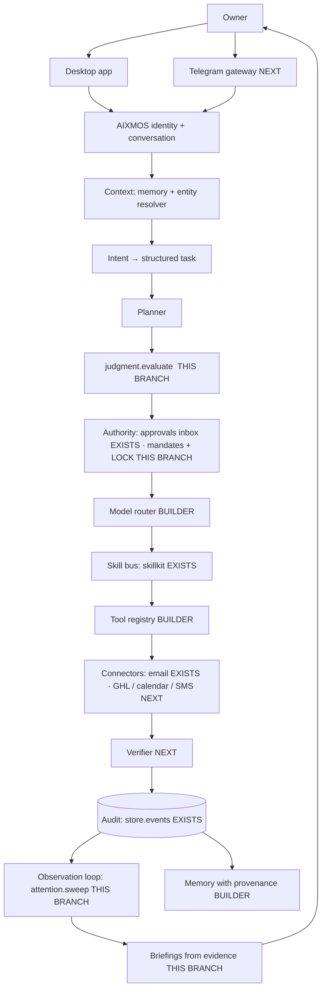

# AIXMOS — the digital right-hand operating system

Architecture and build plan for the owner's Core Product Directive (2026-10-04): **JARVIS utility + Vision judgment +
machine-speed execution + human authority.** It extends `MASTER-PROMPT-AGENT-RUNTIME-2026-10-04` (the builder's spec
on `wave0/head-agent-core`) and does not replace it. This file maps every layer of the directive onto real modules.
Each layer is marked with what exists, what is being built, and what is next.

Status words: **EXISTS** (merged on `wave0/head-agent-core`), **BUILDER** (the live builder session's lane, in
progress), **THIS BRANCH** (`core/right-hand-os`, tested here), **NEXT** (not started).

## 1. One identity, many capabilities

The owner talks to **AIXMOS**. Skills, models, agents and connectors are resources underneath. Nothing in the UI or the
replies exposes them unless the owner asks.

## 2. The six loops → code

| Loop | Path through the code | Status |
|---|---|---|
| 1 Conversation | chat → `intents.detect` / `agent.py` tool loop | EXISTS (dispatch duplicated; BUILDER consolidating) |
| 2 Execution | request → `judgment.evaluate` → `approvals.propose` (owner tap / autopilot / **mandate**) → `outcomes.before` (business rules again) → executor → `channels` re-check → `outcomes.after` (postcondition) → audit | EXISTS + THIS BRANCH (R1 + R2) |
| 3 Observation | audit events → `attention.sweep` → level → interrupt or digest | THIS BRANCH (internal events). External events (GHL webhooks, inbox) NEXT |
| 4 Memory | `memory_store.py` port (source, scope, confidence, timestamp, owner, editable) | BUILDER (owner approved the port 10-04) |
| 5 Improvement | outcome → evaluation → *proposed* workflow change as a draft | NEXT. Can never touch policy: `judgment.SELF_AUTHORITY` + `mandate.NEVER_SEGMENTS` |
| 6 Relationship | preferences learned → stored as memory with provenance → applied to tone and timing | NEXT, on top of loop 4 |

## 3. The line AIXMOS never crosses (enforced in code, tested)

| Directive "never" | Where it is enforced | Test |
|---|---|---|
| expand its own permissions / modify security policy | `judgment.SELF_AUTHORITY` refuses `permission.*`, `security.*`, `settings.*`, `mandate.*`, `*.grant`, `*.replicate` … whoever asks | `test_never_touches_own_authority` |
| execute consequential actions outside configured authority | `approvals` inbox; mandates cover only listed kinds; spend + public posts are never delegable | `test_mandate_runs_inbox_items_and_is_recorded` |
| treat external content as commands | `requested_by="external:*"` is always refused. Content can raise attention to *important*, never *urgent*, and never pushes a notification | `test_content_is_data_not_command`, `test_levels_and_content_cannot_page` |
| fabricate completed actions | briefings count only audit events / executed approvals and carry evidence ids; empty means "nothing recorded" | `test_counts_match_the_record`, `test_empty_business_invents_nothing` |
| widen a mandate / revive authority | drafts grant nothing; only owner channels activate; there's no extend or edit; 14-day cap; unlock never revives | `test_draft_grants_nothing_until_owner_activates`, `test_lock_stops_everything_automatic` |
| a tool call claiming to be the owner | `chief_of_staff_check` forces `requested_by="agent"` | `test_chief_of_staff_loads_with_tools_and_timers` |
| replicate itself / bypass auth / hide actions | no such code path exists; every inbox decision and mandate change is an audit event | (design review) |

## 4. What this branch adds (milestone R1: authority + attention + judgment + briefings)

New files only, plus two small hooks, so it never collides with the builder's uncommitted work:

| File | Role |
|---|---|
| `super-agent/aixmos/mandate.py` | Away-mandates ("I'm away until Monday, keep things moving") as WILL / ASK BEFORE / ALERT plans. Time-boxed, owner-activated, never-delegable segments. **LOCK AIXMOS**: any owner channel can lock, only this computer can unlock. |
| `super-agent/aixmos/attention.py` | Five levels: background, routine, important, decision, urgent. Interrupt policy (urgent always; decisions outside quiet hours; one per kind per hour; 4/h cap), dedupe, digest, outbox for channels to deliver. `sweep()` is the observation loop over audit events. |
| `super-agent/aixmos/judgment.py` | The pre-action check in fixed order: within authority → identity → lock → target → missing facts → confidence → business rules + blast radius → reversibility. Returns proceed / confirm / ask / refuse with options and impact. "Send everyone 50% off" → *confirm*, with "438 people (1 can't be messaged)", the rule conflict, and segment options. |
| `super-agent/aixmos/briefing.py` | Morning briefing and end-of-day report built only from the record, with evidence ids per number. |
| `super-agent/skills/chief_of_staff/` | Built-in skill. A 5-minute sweep and a 07:30 briefing (via the existing scheduler), plus agent tools: brief, attention, check, draft-mandate. |
| `super-agent/aixmos/approvals.py` (hook) | `propose(auto=True)` also runs under an active mandate (`decided_by="mandate:<id>"`). LOCK stops autopilot, mandates and remote approvals. |
| `super-agent/aixmos/head.py` (routes) | `GET /api/head/mandates·attention·brief`, `POST /api/head/mandates/draft·activate·revoke`, `/lock`, `/unlock`, `/attention/ack`, `/judge` |
| `super-agent/aixmos/outcomes.py` (R2) | The five states, kept apart: REQUESTED → AUTHORIZED → VERIFIED → EXECUTED → SUCCESSFUL, plus BLOCKED / FAILED / NOT CONFIRMED. Prechecks run just before execution. If an automatic approval (autopilot or mandate) breaks the business rules, the item goes back to the owner's inbox instead of sending or failing. Postcondition verifiers decide SUCCESSFUL. Email is only ever "accepted by your mail provider": delivery and bounces aren't visible. `GET /api/head/outcome?id=`. |
| `super-agent/tests/test_right_hand.py` | 28 tests. Merged with the builder's wave1 (`e260907`), the full suite is 146 tests, 0 failures (3 licence tests skip because `cryptography` isn't installed). |

New tables (created by each module on first use; fold into `store.SCHEMA` on merge): `mandates`, `attention`. New
prefs (registered at import; fold into `settings.DEFAULT_PREFS` on merge): `business_rules`, `attention_rules`,
`attention_max_per_hour`, `attention_kind_minutes`.

## 5. Authority matrix (what decides each action)

| Who asked → / risk ↓ | owner (desktop) | owner (Telegram, paired) | active mandate | agent on its own | external content |
|---|---|---|---|---|---|
| low: read, search, draft, analyze | proceed | proceed | proceed | proceed | refuse (it's data) |
| medium: internal record changes | proceed | proceed | proceed | proceed | refuse |
| high: send, reply, bulk message | confirm | confirm | proceed **only for listed kinds** | confirm | refuse |
| high + irreversible | confirm | confirm | confirm | confirm | refuse |
| spend money / publish publicly | confirm | confirm | **never delegable** | confirm | refuse |
| contracts, pricing, refunds, deletes | confirm | confirm | **never delegable** | confirm | refuse |
| own permissions, security, settings | refuse (owner does it in Settings) | refuse | refuse | refuse | refuse |
| any change while LOCKED | confirm (local only) | refuse | revoked | refuse | refuse |

Business-rule conflicts and blast radius (`bulk_confirm_over`, default 25) turn *proceed* into *confirm* with options.
Unknown target, missing facts, or confidence below 0.6 turn into *ask*.

## 6. Build sequence

Lanes keep ONE writer per file. B = builder session (`wave0/head-agent-core`); R = right-hand lane (this branch).

**Days 0–30: foundation (the master spec's Phase 1–3)**
- B: provider abstraction (`providers.py`, Ollama + LM Studio + Anthropic, health, privacy routing); typed tool
  registry with risk / approval / timeout / retry; close current-state §5 items 1–3; port `memory_store.py`.
- R1 (done here): mandates + LOCK, attention, judgment, briefings, chief_of_staff skill.
- R2 (done here): **execution states** in `outcomes.py`. Each kind can register a precheck and a postcondition
  verifier. Next: real verifiers for each connector as it lands (e.g. GHL: re-read the contact or note after writing).
- GHL read connector: official API v2, Private Integration Token, mock + recorded fixtures until the sandbox
  sub-account exists (owner decision). Lead/conversation content enters as `external:ghl`.

**Days 31–60: the right hand becomes reachable**
- Telegram gateway (§31): own bot per install, pairing challenge, `owner:telegram` identity, drains
  `attention.outbox()`, inline buttons carry approval ids bound to an action hash + expiry, `/lock` from the phone.
- Entity resolver: "What's happening with Johnson?" → one answer across CRM + calendar + documents + audit. It's a
  resolver over connectors, not a second database; ambiguous names go through `judgment` *ask*.
- Lead-response drafting with Brand Profile + `judgment` before every send; GHL writes behind the inbox.
- Conversational references ("those three") as structured task context, not raw chat history.

**Days 61–90: delegation of outcomes**
- "Handle my new leads" end to end (the master spec's §27 acceptance test), then the §22 eval suite as CI.
- Mandate drafting from natural language ("I'm away until Monday") → plan → owner taps activate (mechanism done in R1).
- Calendar + Gmail connectors; contract generation from owner-approved templates only (never delegable).
- Improvement loop: weekly "what failed and what I'd change", proposed as drafts and never self-applied.

## 7. Owner decisions that block or shape the next steps

1. **Merge path:** `origin/core/right-hand-os` already contains the builder's `e260907`. The builder was asked
   (10-05) to merge it into `wave0/head-agent-core` after its current batch (GHL). The new owner routes are in
   `OWNER_ONLY` (app token required).
2. **Default business rules (set 10-05, change any time in prefs `business_rules`):** any price or discount needs the
   owner; "guaranteed results", "risk-free", "no risk", "100% guaranteed", "act now or lose" and "limited time only"
   never go out without the owner's OK; more than 25 people counts as bulk. No max-discount number is set: every
   discount already needs the owner.
3. **Briefing time and channel:** 07:30 local by default; Telegram needs its own bot (owner creates it in BotFather).
4. **GHL sandbox sub-account + token:** still the blocker for the connector (current-state §7.4).
5. **Can publishing ever be delegated?** Today `post` is never delegable. Loosening that is an owner call.
